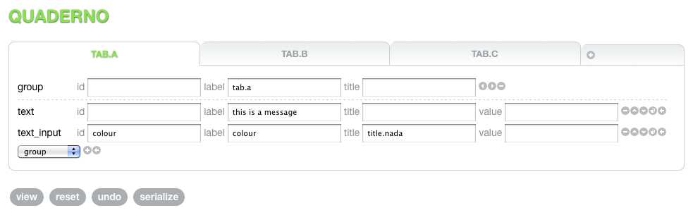

# quaderno

a mini form templating system in javascript.

## usage

TODO

## testing

requires spidermonkey or (prerefably, better stack traces) rhino.

  ruby test/test.rb

one test at a time

  ruby test/test.rb x

where x is the number (integer) of the test. For example

  ruby test/test.rb 0

will run the test test/qt_0_identify.js

## credits

Jamandru Reynolds - http://geometron.net/ - CSS and general appearance

## license

MIT

